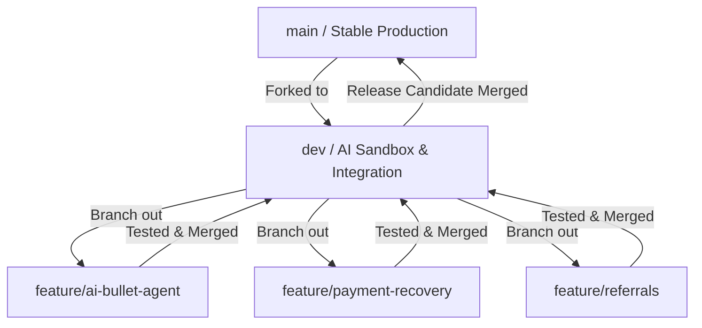

# ANTIGRAVITY ATS 2.0 — BRANCHING STRATEGY

This document outlines the professional branching architecture and repository rules for the **CV⚡BOOST** (ANTIGRAVITY ATS 2.0) codebase. 
This strategy is engineered to optimize release speed for solo founders while providing absolute bulletproof safety for working payment (Razorpay) and database (Firestore) systems.

---

## ━━━━━━━━━━━━━━━━━━━━━━━━━━━━━━━━━━
## 🎯 BRANCH ARCHITECTURE OVERVIEW
## ━━━━━━━━━━━━━━━━━━━━━━━━━━━━━━━━━━

Our repository follows a structured, lightweight branching system that separates stable business assets from experimental AI capabilities:



---

## ━━━━━━━━━━━━━━━━━━━━━━━━━━━━━━━━━━
## 📦 BRANCH TYPES & PROTOCOLS
## ━━━━━━━━━━━━━━━━━━━━━━━━━━━━━━━━━━

### 1. `main` (Production Branch)
* **Status:** Protected.
* **Purpose:** Serves as the single source of truth for the stable, live production deployment.
* **Content:** Only fully tested, payment-safe features.
* **Rules:**
  * **No direct commits.**
  * No experimental AI systems or untested UI changes are allowed to enter `main` directly.
  * Must compile flawlessly under Next.js production builds (`npm run build` must return code `0`).

### 2. `dev` (Development Branch)
* **Status:** Active integration sandbox.
* **Purpose:** The staging ground for innovative features (such as experimental AI agents, ATS analyzers, and algorithmic tune-ups).
* **Content:** All active developments and staging code.
* **Rules:**
  * Created once from `main` to serve as the baseline.
  * Staged here for sandboxed testing.
  * Can occasionally contain temporary workarounds, mock settings, or debug logs.

### 3. Feature Branches (`feature/*`)
* **Status:** Isolated workspaces.
* **Naming Convention:** `feature/<short-desc>` (e.g. `feature/ai-agents`, `feature/payment-recovery`).
* **Purpose:** Single-scope isolated tasks.
* **Rules:**
  * Branches must merge into `dev` (never directly into `main`).
  * Kept short-lived to prevent huge merge conflicts.

---

## ━━━━━━━━━━━━━━━━━━━━━━━━━━━━━━━━━━
## ⚡ GIT COMMAND SEQUENCES
## ━━━━━━━━━━━━━━━━━━━━━━━━━━━━━━━━━━

### A. Creating and Working on a Feature
Always create new feature branches from a clean, updated `dev` branch:

```bash
# 1. Switch to dev branch and pull the latest changes
git checkout dev
git pull origin dev

# 2. Spin off a new feature branch
git checkout -b feature/ai-resume-optimizer

# 3. Work on your files, commit your modifications
git add .
git commit -m "feat: implement GPT-based dynamic ATS keyword injector"
```

### B. Merging a Feature into `dev`
Once your feature is complete and verified locally:

```bash
# 1. Pull latest dev changes into your local dev
git checkout dev
git pull origin dev

# 2. Switch back to your feature and merge dev to resolve any conflicts locally
git checkout feature/ai-resume-optimizer
git merge dev

# 3. Run validation tests
npm run build

# 4. Switch to dev and merge squash the feature to keep commits clean
git checkout dev
git merge --squash feature/ai-resume-optimizer
git commit -m "feat: integrate GPT-based dynamic ATS keyword injector (#12)"

# 5. Safely clean up local feature branch
git branch -d feature/ai-resume-optimizer
```

### C. Merging `dev` into `main` (Production Release)
Only trigger this when a series of features in `dev` are fully checked, tested, and ready for deployment:

```bash
# 1. Switch to main and pull latest production state
git checkout main
git pull origin main

# 2. Merge dev into main (non-fast-forward to record the release event)
git merge --no-ff dev -m "release: deploy campaign v2.0 - stable AI ATS generation"

# 3. Tag the release for easy rollback
git tag -a v2.0.0 -m "Stable campaign release v2.0.0"

# 4. Push release to remote
git push origin main --tags
```

---

## ━━━━━━━━━━━━━━━━━━━━━━━━━━━━━━━━━━
## 🚨 ROLLBACK & CONFLICT MANAGEMENT
## ━━━━━━━━━━━━━━━━━━━━━━━━━━━━━━━━━━

### 1. Rolling Back Production (`main`)
If an issue slips past tests and breaks the payment/database gates in production, trigger a safe git rollback immediately:

```bash
# Option A: Fast Local Reset (If you need to instantly redeploy a previous tagged version)
git checkout main
git reset --hard v1.9.0  # Reset main state back to tag v1.9.0

# Option B: Safe Reversion (If you want to keep commit history clean)
git log --oneline -n 5   # Locate the breaking merge commit hash (e.g. abc1234)
git revert -m 1 abc1234  # Revert the entire merge commit
git commit -m "revert: rollback unstable dev release"
```

### 2. Resolving Merge Conflicts
If two branches modify the same code region, Git will halt during a merge. Use this workflow to resolve cleanly:

```bash
# 1. Identify conflicting files (Git will output them in red)
git status

# 2. Open conflicting files. Locate Git merge markers:
# <<<<<<< HEAD
# <Your stable code in main/dev>
# =======
# <Your incoming changes in the branch>
# >>>>>>> feature-branch

# 3. Clean up the markers, keep the correct code merge, and save.

# 4. Stage and finish the merge
git add <resolved-file>
git commit -m "merge: resolve conflicts with dev branch"
```

---

## 💡 SOLO-FOUNDER SAFETY CHECKLIST
Before merging any code from `dev` to `main`:
1. [ ] **Sandbox Mode Activated?** Check that Razorpay is running in local checkout test/mock modes or carrying standard variables for public testing.
2. [ ] **No Secrets Exposed?** Run `git status` to verify no `.env.local` or service account keys are in the staging index.
3. [ ] **Flawless Compilation?** Run `npm run build` locally. If Next.js fails to build, **never merge**.
4. [ ] **Database Rules Intact?** Ensure that the database paths are user-scoped (`resume_${user.uid}`) so users cannot overwrite peer data.
