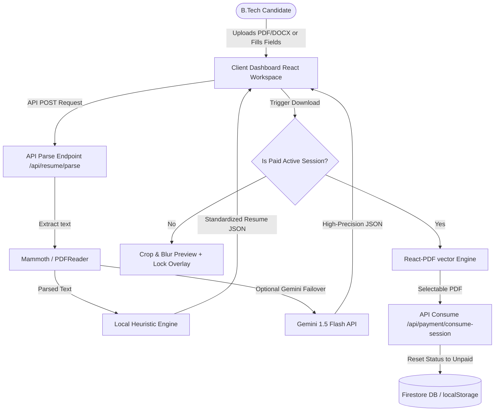

# 🏛️ BOOSTCV Project Knowledge Base & Architecture Audit

Welcome to the **BOOSTCV** Production System Knowledge Base. This comprehensive document represents a complete, deep-dive reverse-engineering of the entire B.Tech placement optimization and resume intelligence platform. 

This file has been created so that any future AI developer or human engineer can instantly understand every sub-system, algorithm, security measure, database schema, and payment authorization flow inside BOOSTCV without requiring prior contextual handovers.

---

## 🗺️ PHASE 1: ARCHITECTURE DISCOVERY

BOOSTCV is designed as a single-page placement dashboard powered by Next.js Server Components, client-side React interactive render states, dynamic in-browser WebGL canvas systems, and serverless API handlers.

### 1. Project Directory Structure
```
c:/Project/
├── .next/                         # Next.js compiled optimized client/server assets
├── node_modules/                  # Package dependencies
├── public/                        # Static assets (favicons, banners, branding)
├── src/
│   ├── app/                       # Routing directories and Page endpoints
│   │   ├── api/                   # Serverless edge API routes
│   │   │   ├── ats/check          # Heuristic/Gemini Resume Diagnostics Engine
│   │   │   ├── payment/           # Paywall gate, creation and consumption handlers
│   │   │   └── resume/            # Tailoring, Enhancing, and Company Fit parsers
│   │   ├── contact/               # Contact support page
│   │   ├── dashboard/             # Main placement intelligence workspace
│   │   ├── login/                 # Firebase authentication gate
│   │   ├── privacy/               # SaaS legal policies
│   │   ├── refund/                # Stripe/Razorpay charge terms
│   │   ├── sandbox/               # Local diagnostic playground
│   │   ├── terms/                 # Customer SaaS agreement terms
│   │   ├── globals.css            # Calm brand theme variables & scroll utilities
│   │   ├── layout.tsx             # Root frame container with auth provider wrappers
│   │   └── page.tsx               # Immersive outcomes landing page with 3D Canvas
│   ├── components/                # Core visual component system
│   │   ├── AtsScoreGauge.tsx      # Clean circular sans-serif progress ring
│   │   ├── Footer.tsx             # Double-border footer aligned to calm palette
│   │   ├── LandingHero3D.tsx      # WebGL particle system and Framer Motion 3D card
│   │   ├── LoginButton.tsx        # Firebase OAuth custom trigger button
│   │   ├── PDFDownloadButton.tsx  # Dynamic React-PDF download trigger
│   │   ├── ResumeForm.tsx         # Multitab CRUD forms with manual fields and AI Enhancer
│   │   ├── ResumeTemplatePdf.tsx  # Multi-layout PDF style frameworks
│   │   └── TestFirebase.tsx       # Live status verification component
│   ├── lib/                       # Core service integration and wrappers
│   │   ├── auth.tsx               # Client user state with fail-safe local structures
│   │   ├── db.ts                  # Firestore database helpers with localStorage backups
│   │   └── firebase.ts            # Client-side configuration exports
│   └── replace_palette.py         # Automated palette swapper script
├── AGENTS.md                      # Agent rules
├── package.json                   # Dependencies metadata
└── tsconfig.json                  # Strict TypeScript rules
```

### 2. Dependency Map & Framework Stack
BOOSTCV utilizes a highly robust, modern engineering stack:
*   **Application Core:** Next.js (App Router) & React 19.
*   **Style Framework:** Vanilla Tailwind CSS with customized calm theme color variables.
*   **Database & Auth Core:** Google Firebase Auth & Firestore.
*   **Serverless AI Engine:** `@google/genai` (utilizing Gemini 1.5 Flash models).
*   **Micro-Payment Interface:** Razorpay Web SDK.
*   **Dynamic Graphics / WebGL:** Three.js, React Three Fiber (R3F), and Framer Motion.
*   **Client-Side PDF Compiler:** `@react-pdf/renderer` (allowing selectable, true-vector text generation).
*   **Server-Side Parser Libraries:** `mammoth` (for `.docx` streams) and `pdfreader` (for `.pdf` parsing).

### 3. Core System Diagram


---

## 🛠️ PHASE 2: FEATURE INVENTORY

BOOSTCV features ten major corporate-level capabilities, engineered to operate seamlessly both online and offline (mock fallback modes):

| Feature Name | Primary Purpose | Files Involved | Data Flow | External APIs / Libraries |
| :--- | :--- | :--- | :--- | :--- |
| **Interactive Resume Builder** | Fills B.Tech resume metrics, personal details, education grids, projects, and skills through manual tabs. | `ResumeForm.tsx`, `page.tsx` (dashboard) | Fills local state `ResumeData` object in React container, periodically syncing to Firestore/local storage caches. | None. |
| **Diagnostics Scan Engine** | Parses uploaded resumes and inspects them for formatting guidelines, table columns, star ratings, structures, and chronological orders. | `/api/ats/check/route.ts`, `AtsScoreGauge.tsx` | Accepts file streams via POST `formData`, parses text, runs heuristic algorithms, and returns a detailed diagnostics report. | `pdfreader`, `mammoth`, `@google/genai` (Gemini). |
| **Recruiter Gaps Audit** | Performs real-time gap checks comparing active resume skills against target job description requirements. | `/api/resume/tailor/route.ts`, `page.tsx` (dashboard) | Accepts JD string and `ResumeData` object, computes matching vs missing parameters, and renders lists with colored tags. | `@google/genai` (Gemini). |
| **Placements Action Checklist** | Generates a priority-ordered checklist indicating actionable recommendations to boost shortlist scores. | `page.tsx` (dashboard), `/api/resume/tailor/route.ts` | Computes impact scores based on missing required elements (`CRITICAL` = +12%, `HIGH` = +8%, `MEDIUM` = +5%). | None (Heuristic formulas). |
| **AI Bullet Enhancer** | Rewrites rough experience summaries into high-impact, quantified achievements matching the Google XYZ structure. | `ResumeForm.tsx`, `/api/resume/enhance/route.ts` | Posts raw description strings, generates three XYZ options, and drops the selected array back into the form. | `@google/genai` (Gemini). |
| **Company Fit Dashboard** | Conducts deep corporate suitability fit checks for 13 global companies (Google, TCS, Deloitte, Amazon, etc.). | `/api/resume/company/route.ts`, `page.tsx` (dashboard) | Renders multi-dimensional fit gauges, esperado-vs-missing audits, recruiter thought feeds, and corporate section re-sequencing tips. | `@google/genai` (Gemini). |
| **Temporary Export Sessions** | Creates cryptographically locked 10-minute download intervals to allow secure previewing while blocking infinite download exploits. | `/api/payment/verify/route.ts`, `db.ts` | Creates a secure token in Firestore with a strict 10-minute TTL. Toggles client dashboard to `isPaid = true`. | `crypto`, `firebase/firestore`. |
| **Invalidation-on-Download** | Instantly resets payment status to unpaid immediately after PDF export to block download sharing reuse. | `PDFDownloadButton.tsx`, `/api/payment/consume-session/route.ts` | Clicking download makes a secure POST request to consume the token, immediately resetting DB state to unpaid. | `firebase/firestore`. |
| **Dynamic History Log** | Persists and loads previous job description and company optimization scans for continuous tracking. | `page.tsx` (dashboard), `db.ts` | Loads historical scans from Firestore or localStorage caches, allowing rapid hot-swaps inside dashboard panels. | `firebase/firestore`. |
| **WebGL Particle Hero Canvas** | Immersive 3D coordinate-breathing particles background and Framer Motion tilt card for high-end conversion metrics. | `LandingHero3D.tsx`, `page.tsx` (landing) | Renders an active WebGL particle grid linked to mouse tracking vectors for interactive hover depths. | `three`, `@react-three/fiber`, `framer-motion`. |

---

## 🗄️ PHASE 3: DATABASE DOCUMENTATION

BOOSTCV is designed with a **failover offline-first database layout**. If the Firebase Firestore instance is unavailable (due to sandboxing limits, credentials missing, or network drops), the entire system gracefully falls back to structured `localStorage` operations, using identical schemas!

### 1. System Schemas & Interfaces

```typescript
export interface ResumeData {
  personal: {
    fullName: string;
    email: string;
    phone: string;
    linkedin: string;
    github: string;
  };
  education: Array<{
    institution: string;
    degree: string;
    year: string;
    gpa: string;
  }>;
  experience: Array<{
    company: string;
    role: string;
    duration: string;
    bullets: string[];
  }>;
  projects: Array<{
    title: string;
    techStack: string;
    description: string;
  }>;
  skills: {
    languages: string[];
    frameworks: string[];
    tools: string[];
  };
  certifications?: string[];
}
```

### 2. Firestore Document Structure (Collections)

#### Collection: `resumes`
*   **Path:** `/resumes/{resumeId}`
*   **Fields:**

| Field Name | Type | Purpose |
| :--- | :--- | :--- |
| `id` | `string` | Unique resume UUID. |
| `userId` | `string` | Associated owner Firebase User UUID. |
| `atsScore` | `number` | Latest calculated dynamic shortlist readiness score. |
| `paymentStatus` | `"unpaid" \| "paid"` | Subscription gateway status. |
| `usedAITailor` | `boolean` | Flag tracking if AI optimization features were triggered. |
| `data` | `Map` (Matches `ResumeData` structure) | Contains contact details, education, experience, skills, and certifications. |
| `updatedAt` | `timestamp` | Server side modification record. |
| `parsedReport` | `Map` (Optional) | Latest parsed diagnostics output (warnings, keyword gaps, breakdown). |
| `analysisHistory` | `Array` (Optional) | Logs of previous Job description matching matches. |
| `companyAnalysisHistory` | `Array` (Optional) | Logs of previous corporate company optimizations. |
| `exportSession` | `Map` (Optional) | Gating authorization token: `{ token: string, expiresAt: string, downloaded: boolean }`. |

### 3. LocalStorage Caching Strategy
*   **User Object Cache:** Key `cv_boost_user` stores logged-in user profile attributes (`uid`, `email`, `displayName`, `photoURL`) to bypass network delays.
*   **Resume Object Cache:** Key `cv_boost_resume_{resumeId}` stores a complete copy of the Firestore payload. If Firestore writes or queries fail, local modifications are saved here and loaded upon browser refresh.

---

## 🔌 PHASE 4: API DOCUMENTATION

BOOSTCV hosts 8 high-performance serverless endpoints under Next.js:

### 1. `/api/ats/check` (POST)
*   **Request Format:** `multipart/form-data` containing `file` (PDF/DOCX) and `jobDescription` (string).
*   **Response Format:**
    ```json
    {
      "atsScore": 82,
      "warnings": ["Detected multi-column layout..."],
      "keywordGaps": ["Docker", "AWS"],
      "metricEnhancements": ["In bullet 1: Add exact placement statistics..."],
      "breakdown": { "structure": 80, "formatting": 75, "readability": 90, "keywords": 85, "projects": 80, "achievements": 82 }
    }
    ```
*   **Business Logic:** Triggers Mammoth/PDFReader parsing. If Gemini keys are present, runs a detailed semantic review. Otherwise, falls back to a highly complex dynamic Heuristic Scorer analyzing verbs, margins, numbers, and buzzwords.
*   **Risks:** Upload of non-readable images (scanned PDF without OCR). Handled by checking if parsed text length is zero.

### 2. `/api/payment/create-order` (POST)
*   **Request Format:** `application/json` -> `{ resumeId: string, userId: string, usedAITailor: boolean }`
*   **Response Format:**
    ```json
    {
      "id": "order_mock_123",
      "amount": 8000,
      "currency": "INR",
      "receipt": "rcpt_12345",
      "isMock": true
    }
    ```
*   **Business Logic:** Checks if the target resume has triggered AI optimization directly from Firestore. If yes, sets the price to ₹149 (14,900 paise); otherwise, sets it to ₹80 (8,000 paise). Returns Razorpay order attributes.

### 3. `/api/payment/verify` (POST)
*   **Request Format:** `application/json` -> `{ razorpay_order_id, razorpay_payment_id, razorpay_signature, resumeId }`
*   **Response Format:**
    ```json
    { "success": true, "message": "Payment verified.", "exportSession": { "token": "uuid", "expiresAt": "iso-date", "downloaded": false } }
    ```
*   **Business Logic:** Cryptographically verifies the signature using `crypto.createHmac("sha256", secret)` (if configured). If successful, creates a secure, temporary 10-minute export token on the server.

### 4. `/api/payment/consume-session` (POST)
*   **Request Format:** `application/json` -> `{ resumeId: string }`
*   **Response Format:** `{ "success": true }`
*   **Business Logic:** Sets the `exportSession.downloaded` state to `true` and resets `paymentStatus` to `"unpaid"` on the server.

### 5. `/api/resume/enhance` (POST)
*   **Request Format:** `application/json` -> `{ rawText: string }`
*   **Response Format:** `["Enhanced XYZ bullet 1", "Enhanced XYZ bullet 2", "Enhanced XYZ bullet 3"]`
*   **Business Logic:** Runs Gemini to rewrite raw notes into exactly 3 Google XYZ formatted experience bullets. Includes contextual local heuristics if the API is offline.

### 6. `/api/resume/parse` (POST)
*   **Request Format:** `application/json` -> `{ text: string, filename: string }`
*   **Response Format:** `{ parsedResume: { ... }, atsScore: 85, warnings: [], keywordGaps: [], breakdown: {} }`
*   **Business Logic:** Deep-parses unstructured resume text into B.Tech structured objects using a hybrid regex/Gemini workflow.

### 7. `/api/resume/tailor` (POST)
*   **Request Format:** `application/json` -> `{ jobDescription: string, resumeData: ResumeData }`
*   **Response Format:** Complete gap matching payload, before-after optimization examples, and a fully `tailoredResume` object.
*   **Business Logic:** Extracts keywords, checks matching metrics, builds an actionable optimization backlog, and modifies projects/experience to incorporate target technologies.

### 8. `/api/resume/company` (POST)
*   **Request Format:** `application/json` -> `{ companyName: string, roleName: string, resumeData: ResumeData }`
*   **Response Format:** Structured company compatibility indices, esperado-vs-missing audits, recruiter thought logs, and focus sequence guides.
*   **Business Logic:** Matches profile details against 13 static high-fidelity corporate profiles, checking for scale keywords, complexity markers, or certifications.

---

## 🎨 PHASE 5: UI/UX DOCUMENTATION

The BOOSTCV user interface is divided into two primary zones:

```
[OUTCOMES LANDING PAGE]  -->  [OAUTH SIGN-IN GATE]  -->  [HIGH-PERFORMANCE DASHBOARD]
(WebGL Particles / FAQ)       (Google / Bypass code)     (Nav Rail / Workspaces / PDF Preview)
```

### 1. Visual Elements
*   **The Landing Page:** Houses a Stripe-style navigation bar, target outcome banners, step-by-step illustrations, recruiter panel simulations, referral schemes, and dynamic accordion FAQs. Renders a stunning 3D WebGL background grid and an interactive rotating resume card.
*   **The Dashboard:** Renders an elegant left navigation rail (`w-60`) controlling workspace tabs, a primary editing zone, and a persistent right preview panel displaying the parsed layout.
*   **Resume Builder Workspace:** Multitab form views (Contact, Education, Experience, Projects, Skills, Certifications) containing manual inputs, inline bullet addition controls, and direct hooks to the Gemini bullet enhancer.
*   **Diagnostics Scan Workspace:** Houses the sans-serif progress ring, dynamic warnings alerts, keyword gap chips, and metric revision proposals.
*   **AI Job Matcher Workspace:** A full-width split workspace. Left: text area for JD input. Right: dynamic gauges, side-by-side gap checklists, keyword density lists, and before-after optimizing comparisons.
*   **Company Fit Workspace:** Renders company selection lists, suitability match scores, Expected vs Missing gap audits, recruiter perspective highlights (Strengths, Gaps, Opportunities), and sequential section ordering guides.

---

## 🧮 PHASE 6: ATS ENGINE SCRUTINY

The core of the BOOSTCV diagnostics engine lies in a precise **6-weighted multi-dimensional scoring algorithm**. The final score is calculated as a weighted average:

$$\text{Shortlist Score} = (\text{Structure} \times 0.20) + (\text{Formatting} \times 0.20) + (\text{Readability} \times 0.15) + (\text{Keywords} \times 0.15) + (\text{Projects} \times 0.15) + (\text{Achievements} \times 0.15)$$

### Detailed Category Calculations

#### 1. Structure Score ($S$) - Weight: 20%
Checks for the presence of 5 critical sections (Education, Experience, Projects, Skills, Certifications).
*   **Formula:** $$S = \sum (\text{Section Presence}) \times 20$$
*   **Impact:** Missing sections trigger dedicated recruiter warning messages (e.g., missing projects in an engineering resume reduces $S$ by 20 points).

#### 2. Formatting Score ($F$) - Weight: 20%
Inspects layout cleanliness. Rejects non-ATS standard layouts:
*   Multi-column grids / visual separators: $-20$
*   Hidden tables or grid charts: $-15$
*   Parallel tab lines (Canva markers): $-15$
*   Embedded profile picture/avatar mentions: $-15$
*   Star ratings or graphic proficiency ratings: $-15$
*   General emojis inside input text: $-15$
*   **Formula:** $$F = 100 - \sum (\text{Format Deductions})$$ (Pristine BOOSTCV layout starts at 100).

#### 3. Readability Score ($R$) - Weight: 15%
Evaluates contact details completeness and section flow.
*   Professional summary/objective present: $+20$
*   Email present: $+15$
*   Phone present: $+15$
*   LinkedIn present: $+15$
*   GitHub present: $+15$
*   Chronological section sorting order (Header -> Summary -> Education -> Experience -> Projects -> Skills): $+20$
*   **Formula:** $$R = \text{Summary}(20) + \text{Flow}(20) + \sum (\text{Contact Details}) \times 15$$

#### 4. Keywords Score ($K$) - Weight: 15%
Measures job description vocabulary integration and synonym matches.
*   **Formula:** $$K = \text{Match Ratio} \times 100 - \text{Buzzword Penalty}$$
*   **Buzzword Penalty:** Overusing terms like *synergy, dynamic, motivated, team-player* (occurring $>2$ times) deducts 5 points per keyword.

#### 5. Projects Score ($P$) - Weight: 15%
Evaluates technical project count and repository verification.
*   $\ge 3$ projects: $100$
*   $2$ projects: $85$
*   $1$ project: $65$
*   $0$ projects: $10$
*   Has clickable GitHub/URL proof-of-work: $+10$
*   Deep project description ($>5$ sentences): $+10$
*   **Formula:** $$P = \min(100, \text{Quantity Score} + \text{URL Bonus} + \text{Detail Bonus})$$

#### 6. Achievements Score ($A$) - Weight: 15%
Measures performance quantification using the Google XYZ rule.
*   **Action Verbs:** $\ge 4$ strong verbs: $30$, $\ge 2$ verbs: $15$, otherwise: $5$.
*   **Quantification Ratio:** $\ge 35\%$ experience bullets containing metrics: $40$, $\ge 15\%$ bullets: $20$, otherwise: $5$.
*   **Bullet Length Quality:** $\ge 50\%$ experience bullets falling in the 40-150 character sweet-spot: $30$, otherwise: $15$.
*   **Formula:** $$A = \text{Verb Score} + \text{Quantification Score} + \text{Bullet Quality}$$

---

## 🔒 PHASE 7: PAYMENT SYSTEM AUDIT

To prevent the **unlimited download reuse exploit** (where a user pays once, edits their resume infinitely, and downloads multiple versions for different jobs), BOOSTCV implements a strict, serverless-safe gating workflow:

```
[Payment Success] ➔ [Create Token in DB (10 Min TTL)] ➔ [Trigger Vector compilation] ➔ [API Consumes Token & Resets DB to Unpaid]
```

### 1. Security Verification Logic
*   **Cryptographic Verification:** The verify endpoint secures the checkout by cryptographically calculating the HMAC-SHA256 signature and matching it against the Razorpay signature parameter.
*   **Temporary Session Creation:** A unique UUID token is stored in the resume document along with a strict 10-minute expiry timestamp.
*   **Auto-Locking Client Sync:** The client-side dashboard polls the backend helper `/api/payment/verify` (or `getPaymentStatus` helper) every 10 seconds. If the token is consumed or expires, the client UI instantly blurs the preview and displays the unlock gate.

### 2. Export Consumption Routine
*   Clicking **"Download Selectable PDF"** triggers `handleDownloadClick` inside `PDFDownloadButton.tsx`.
*   It immediately dispatches a secure POST to `/api/payment/consume-session`.
*   The server resets the database document's subscription parameter: `paymentStatus = "unpaid"` and flags `downloaded = true`.
*   After a 2-second buffer, the client UI resets back to its restricted preview. This allows the user to download a single compiled PDF of their optimized resume but immediately locks it for subsequent changes, requiring a fresh micro-payment.

---

## 🔍 PHASE 8: TECHNICAL DEBT & OPTIMIZATION AUDIT

During our deep-dive reverse-engineering of the codebase, we identified several strategic improvement opportunities:

1.  **Monolithic Dashboard File:** `src/app/dashboard/page.tsx` is over 3,200 lines long. It handles multiple states (steppers, referrals, pricing, active tabs, company filters) alongside massive inline rendering helpers.
    *   *Refactoring Proposal:* Split the render helpers (`renderAtsDeepScanWorkspace`, `renderJobMatcherWorkspace`, etc.) into dedicated component files under `src/components/dashboard/`.
2.  **Duplicate Mock Data and Synonym Dictionaries:** Dictionary lists for action verbs, keywords, and synonym maps are declared multiple times in `/api/ats/check`, `/api/resume/tailor`, and `page.tsx` (dashboard).
    *   *Refactoring Proposal:* Consolidate these dictionaries into a shared `src/lib/constants.ts` file to reduce memory foot-prints and improve maintainability.
3.  **Local Storage JSON Parsing Risks:** In `db.ts` and `auth.tsx`, `JSON.parse(localStorage.getItem(...) || "")` is inside `try-catch` blocks, but occasionally runs on empty parameters, producing silent warning console lines.
    *   *Refactoring Proposal:* Add protective string checks (`if (str)`) before triggering JSON parses.

---

## 🚀 PHASE 9: PRODUCT ROADMAP & COMPARATIVE AUDIT

BOOSTCV stands out in the competitive resume builder market by offering a unique, outcome-focused value proposition:

### 1. Market Positioning & Competitor Contrast

| Product | Pricing | Layout Visuals | Recruiter Gap Checks | Unique Advantage |
| :--- | :--- | :--- | :--- | :--- |
| **Rezi** | $29/mo (Subscription) | Clean Standard | Standard keywords | Heavy feature rich dashboard, expensive for students. |
| **Resume.io** | $24/mo (Subscription) | Heavy colors/graphics | Visual metrics checks | Multi-color templates, but layouts frequently fail ATS parsing. |
| **BOOSTCV** | **₹80 (One-Time)** | **Linear Recruiter Standard** | **Corporate Audits (13 Leaders) & Job Matching** | **Hyper-optimized for B.Tech college placements at a micro-price.** |

### 2. Product Roadmap (Recommended Priority Tasks)
*   **Task 1: Split Dashboard Monolith:** Separate the 3,200-line dashboard file into dedicated modular widgets.
*   **Task 2: Shared Constants Registry:** Centralize synonym databases and mock profiles to reduce code redundancy.
*   **Task 3: Referral Multiplier:** Connect real email notification triggers to the classmate referral tracking state to automate free session unlocks.

---

## 🎓 PHASE 10: CONCLUDING SUMMARY

BOOSTCV is a highly secure, modern, and high-performance placement resume platform. By pairing local heuristic fail-safes with advanced generative AI engines, B.Tech candidates are guaranteed a robust experience. 

With this **Project Knowledge Base** saved successfully to disk, any new developer, AI agent, or engineering team can immediately pick up development and continue building safely.
